# OSIRIS PLANT MANAGEMENT — Modelo Funcional Objetivo v1.0

> **Etapa de arquitectura funcional. NO implementar.** Documento maestro que gobernará la arquitectura técnica y las fases de implementación. Basado en la baseline `tag: osiris-fase0` y en `docs/osiris-fase0/` (inventario, Economic Engine Inventory, Current vs Target, Risk Register, relationships, security, Visits Assessment, Actas, saneamiento Git).
>
> Regla de oro del diseño: **no diseñar desde cero.** Cada capacidad CURRENT se clasifica como CONSERVAR / EVOLUCIONAR / REEMPLAZAR, y lo faltante como NUEVO.

---

## A. Executive Summary

Osiris debe pasar de un **módulo de formularios sobre un blob JSON** a una **plataforma relacional de gestión del portfolio genético**: una sola aplicación donde genetista → especie → variedad → cliente → contrato → campo → bloque → plantación → OC → vivero → royalties → facturación → cobranza → obligación al genetista están **conectados y navegables en 360°**.

El negocio de Osiris no es un CRM ni un ERP genérico: es **licenciamiento de genética frutal**. El sistema debe responder tres preguntas:

1. **¿Qué tenemos?** — genética, variedades, contratos, clientes, campos, plantas, hectáreas.
2. **¿Qué estamos generando?** — royalties (planta, comercial), fees (entrada, vivero), cobranza, obligaciones a genetistas, margen Osiris.
3. **¿Qué valor podemos generar hacia adelante?** — trials, nuevas plantaciones, pipeline de hectáreas y future royalties.

La Fase 0 dejó un motor económico **caracterizado y congelado** (32 tests) y detectó las brechas de fondo que este TARGET resuelve funcionalmente (sin implementarlas aún):

- **Devengo inexistente** → se introduce el ciclo explícito *devengado → facturado → cobrado* (cliente) y *obligación devengada → pagada* (genetista), desacoplados.
- **Hecho generador del Royalty Planta ambiguo** → se fija en la **OC confirmada por el cliente**.
- **Hectáreas físicas vs cobrables no distinguidas** → se modela el **ajuste de hectáreas por temporada** sin alterar el histórico físico.
- **Fee Entrada imputable al Royalty Planta** → se modela explícitamente evitando **doble participación del genetista**.
- **70/30 hardcodeado solo para "IQ"** → regla **parametrizable** por contrato/variedad/genetista/tipo; la "Reconciliación IQ" evoluciona a **Estado de Cuenta por Genetista** para cualquier genetista.
- **Fee Vivero desconectado** → circuito propio (vivero paga a Osiris, 100% Osiris, 0% genetista) con reconciliación de plantas.
- **Operación Técnica sin uso** → evoluciona a **Informes de Visitas** (técnica/comercial/vivero + tipos configurables) que alimentan tareas y el Future Royalty Pipeline.
- **Sin biblioteca documental ni pipeline** → Expediente Digital transversal + Future Royalty Pipeline en 3 niveles (base instalada / comprometido / potencial).

El resultado objetivo: un **Executive Home** que responde en segundos cómo está funcionando económicamente Osiris y qué requiere atención, con drill-down hasta la ficha 360° de cada entidad.

---

## B. Design Principles

1. **Plataforma relacional, no colección de formularios.** Toda entidad navega hacia las demás.
2. **Contrato/plantación como fuente de verdad económica** (se conserva el patrón CURRENT de derivación + overrides), pero enlazada por **IDs (FK)**, no por strings.
3. **Separar devengo, facturación y cobranza** (cliente) y **obligación y pago** (genetista). Nunca usar "tiene factura" como sustituto de devengo, ni `pagado=true` como sustituto de cobranza estructurada.
4. **Configuración sobre hardcode** cuando exista probabilidad razonable de variación (participación, mes de cobro, tipos de visita/contrato), **sin sobreingeniería**.
5. **Trazabilidad total**: auditoría de eventos críticos + soft delete de registros económicos/contractuales/plantaciones.
6. **Conservar lo bueno**: motor de cohortes+inflación RC, informe técnico de 13 secciones, export PDF/Excel, gate anti-pérdida.
7. **UX ejecutiva**: sobria, densa cuando corresponde, con jerarquía; búsqueda global y drill-down; terreno-friendly para visitas.
8. **Específico del negocio**: si una funcionalidad no aporta a genética/variedades/contratos/trials/viveros/royalties/genetistas/visitas/pipeline, no se agrega "porque un ERP la tiene".

---

## C. Current → Target Overview

Clasificación de cada capacidad CURRENT (ref. `docs/osiris-fase0/`):

| Capacidad CURRENT | Clasificación | Nota |
|---|---|---|
| Contrato como fuente de verdad + derivación de ingresos + overrides por id | **CONSERVAR** | Patrón correcto; migrar enlaces a FK. |
| Motor RC por cohortes + inflación por temporada (Jul–Jun) | **CONSERVAR** | Sofisticado; se conserva conceptualmente. |
| Distinción plantación Comercial vs Prueba/Trial | **CONSERVAR / EVOLUCIONAR** | Base del ciclo Trial y del pipeline. |
| Informe técnico 13 secciones + workflow + PDF/HTML/email | **CONSERVAR / EVOLUCIONAR** | Base común de visita + secciones por tipo. |
| Export PDF/Excel con logo, aging de cobranza | **CONSERVAR** | Reutilizar en Reporting. |
| `participacionIngresos` (participación por tipo de ingreso) | **EVOLUCIONAR** | Jerarquía de reglas + vigencia + arreglar match por especie. |
| Royalty Planta (3 ramas: despacho/factura/cuotas) | **EVOLUCIONAR** | Hecho generador = OC confirmada; estados devengo/factura/cobranza. |
| Estados de ingreso (`nFact` + `pagado` bool) | **REEMPLAZAR** | Estado-máquina devengado→facturado→parcial→cobrado. |
| `ReconciliacionIQ` con `PCT_IQ=0.70`/`PCT_WHT=0.10` hardcodeado | **REEMPLAZAR** | → Estado de Cuenta por Genetista, regla parametrizable. |
| Match obtentor contra `ct.especie` (inexistente) | **REEMPLAZAR** | Match contra especie del ingreso/plantación. |
| Predio como campos planos del contrato | **EVOLUCIONAR** | Entidades Campo → Bloque → Plantación. |
| Fee Vivero dentro de OC vivero, tabla vacía, sin consolidar | **EVOLUCIONAR** | Circuito propio + reconciliación de plantas. |
| Persistencia en blob JSON + anon key sin RLS | **REEMPLAZAR** | Modelo relacional + RLS (fase técnica). |
| Enlaces por string (variedad↔especie↔obtentor) | **REEMPLAZAR** | FK por id. |
| Operación Técnica (0 registros) | **EVOLUCIONAR** | → Informes de Visitas. |
| Tareas Osiris (placeholder) | **NUEVO** | Capacidad transversal Tareas & Alertas. |
| Biblioteca documental (URLs de texto, sin upload) | **NUEVO** | Expediente Digital transversal. |
| Ha cobrables / ajuste de ha | **NUEVO** | Modelo de ajuste por temporada. |
| Imputación Fee Entrada → Royalty Planta | **NUEVO** | Con anti-doble-participación. |
| Devengo / obligación devengada del genetista | **NUEVO** | Estado-máquina de obligación. |
| Future Royalty Pipeline / forecast / valor del portfolio | **NUEVO** | 3 niveles + forecast conceptual. |
| Executive Home ejecutivo, búsqueda global, timeline 360° | **NUEVO** | UX de plataforma. |
| Ciclo Trial explícito (Test Blocks como entidad) | **NUEVO** | Hoy son campos planos / código muerto. |
| Auditoría + soft delete transversales | **NUEVO/EVOLUCIONAR** | Hoy `window.auditLog` parcial. |

---

## D. Information Architecture

Una sola aplicación, sidebar de dominios (no tabs interminables). Dominios propuestos (ajustados sobre la lista de referencia para reducir ruido):

1. **Executive Home** — performance, portfolio, future value, attention.
2. **Genética** — Especies · Variedades (entidad central) · Genetistas/Obtentores.
3. **Clientes & Productores** — ficha 360°.
4. **Contratos & Licencias** — Trial · Comercial · Anexos.
5. **Plantaciones** — Campos · Bloques · Plantaciones (ha físicas/cobrables).
6. **Viveros & Pedidos** — Contratos vivero · OC · Despachos · Fee Vivero.
7. **Royalties & Fees** — Royalty Planta · Royalty Comercial · Fee Entrada · Fee Vivero · Devengo/Facturación/Cobranza.
8. **Genetistas — Estado de Cuenta** — obligaciones, pagos, reconciliación.
9. **Informes de Visitas** — Técnica · Comercial · Vivero · (configurables).
10. **Documentos** — Expediente Digital transversal.
11. **Tareas & Alertas** — capacidad transversal.
12. **Analytics & Future Royalty Pipeline** — Operacional/Management/Executive + pipeline/forecast.

> **Genetistas** se separa de **Genética** porque el *Estado de Cuenta del Genetista* es una vista financiera distinta de la ficha maestra de la variedad/especie. **Clientes** y **Genetistas** son ambos "counterparties" pero con vistas 360° muy distintas (cobro vs pago).

---

## E. Navigation Map

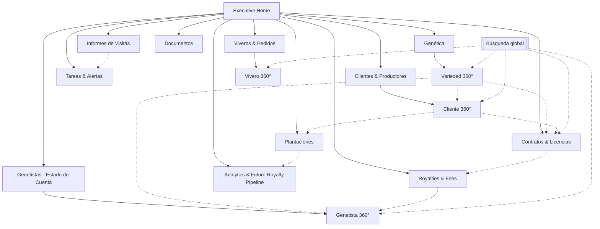

Toda ficha 360° enlaza cruzado (líneas punteadas). La **búsqueda global** entra directo a cualquier ficha.

---

## F. Entity Map

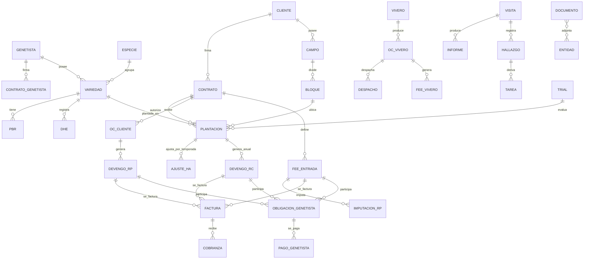

Notas de modelo:
- **Devengo** (RP y RC) y **Fee Entrada** son entidades económicas; se **facturan** (0..N facturas) y las facturas **se cobran** (0..N cobranzas parciales).
- **Fee Vivero** vive en el circuito del vivero, **no** genera obligación al genetista.
- **Documento** es polimórfico (adjunto a cualquier entidad).

---

## G. 360° Views

Principio: al abrir cualquier entidad, se entiende toda su relación con Osiris sin recorrer 10 módulos. **Primer nivel = KPIs + estado + lo accionable; segundo nivel = detalle en tabs/drawers.**

### G.1 Cliente / Productor 360°
- **Primer nivel:** estado (activo), país, KPIs (por cobrar, cobrado YTD, ha comerciales, ha cobrables, plantas licenciadas, contratos vigentes), alertas abiertas.
- **Tabs (2° nivel):** Resumen · Contratos · Variedades · Campos/Predios · Plantaciones · OC/Pedidos · Royalties · Facturas/Cobranza · Informes de Visitas · Documentos · Tareas/Alertas · **Timeline** · Pipeline/Oportunidades.

```text
┌────────────────────────────────────────────────────────────────────┐
│ CLIENTE 360° · Agrícola ABC              [Activo] [+ Acción ▾] [★]  │
├────────────────────────────────────────────────────────────────────┤
│ Resumen · Contratos · Plantaciones · Royalties · Cobranza · Visitas │
│ · Documentos · Timeline · Pipeline                                  │
├──────────────┬──────────────┬──────────────┬──────────────┬────────┤
│ Por cobrar   │ Cobrado YTD  │ Ha cobrables │ Plantas lic. │ Contr. │
│ US$ 84.500   │ US$ 210.300  │ 145 ha       │ 320.000      │ 3 vig. │
├──────────────┴──────────────┴──────────────┴──────────────┴────────┤
│ ⚠ 2 alertas: RC 2027/2028 por facturar · 1 doc PBR por vencer      │
├────────────────────────────────────────────────────────────────────┤
│ Contratos (3)         Variedades (4)        Campos (2)              │
│ · Comercial CHE-2025  · IQ Blue X (Cereza)  · Sta María 60 ha       │
│ · Trial ARA-2026 ...  · ...                 · El Roble 85 ha        │
└────────────────────────────────────────────────────────────────────┘
```

### G.2 Variedad 360° (entidad central)
- **Responde:** ¿dónde está plantada, quién la tiene, bajo qué contrato, cuántas ha, cuántas plantas, cuánto genera y cuánto podría generar?
- **Primer nivel:** especie, genetista, nombre comercial/códigos, estado PBR/DHE por país, KPIs (ha comerciales, ha trial, plantas licenciadas, royalty YTD, royalty pipeline).
- **Tabs:** Resumen · Genetista · Territorios/Países · PBR/DHE/AI · Contratos · Clientes/Productores · Trials · Plantaciones (ha/plantas) · Viveros autorizados · Royalties · Documentos · Informes técnicos · **Pipeline**.

```text
┌────────────────────────────────────────────────────────────────────┐
│ VARIEDAD 360° · IQ Blue X   Especie: Cereza   Genetista: IQ  [Vig.] │
├──────────────┬──────────────┬──────────────┬──────────────┬────────┤
│ Ha comerc.   │ Ha Trial     │ Plantas lic. │ Royalty YTD  │ Pipe.  │
│ 210 ha       │ 18 ha        │ 640.000      │ US$ 312.000  │ +90 ha │
├──────────────┴──────────────┴──────────────┴──────────────┴────────┤
│ PBR: Chile Vigente · Perú En Revisión   DHE: Chile Aprobado         │
│ Clientes (6) · Viveros autorizados (2) · Contratos (7)             │
└────────────────────────────────────────────────────────────────────┘
```

### G.3 Genetista / Obtentor 360°
- **Primer nivel:** datos, contrato, especies/variedades, territorios, KPIs (bruto generado YTD, participación devengada, pagada, **saldo**, WHT).
- **Tabs:** Resumen · Contrato · Especies/Variedades · Territorios · PBR · Anexos · Condiciones económicas (participación) · **Estado de Cuenta** (ver L) · Royalties generados · Obligaciones/Pagos · Documentos · Visitas · Timeline.

### G.4 Vivero 360°
- **Primer nivel:** contrato, KPIs (plantas producidas/despachadas temporada, Fee Vivero devengado/cobrado, diferencias OC vs vendidas vs despachadas).
- **Tabs:** Resumen · Contrato · Variedades autorizadas · Clientes · OC · Despachos · Fee Vivero · Facturación/Cobranza · Visitas · Documentos · Diferencias/Alertas.

---

## H. Contract Lifecycle

Tipos: **Trial**, **Comercial**, **Anexo** (+ futuros configurables). No todos comparten los mismos estados.

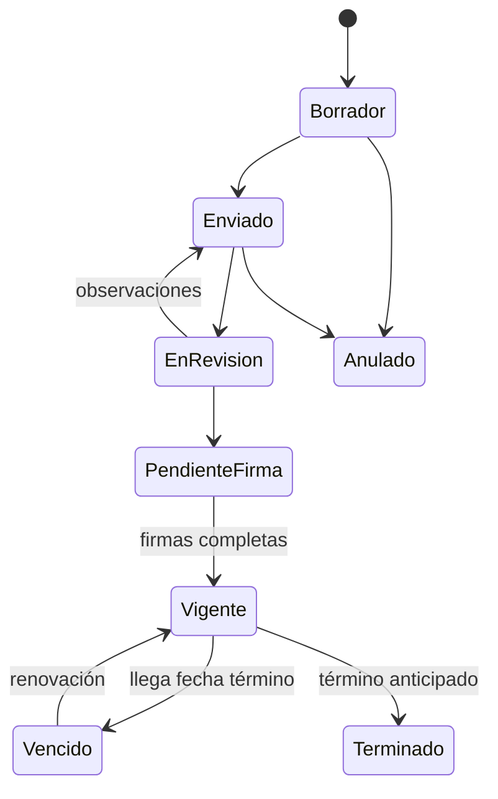

- **Trial** puede tener un flujo más liviano (Borrador → Firma → Vigente → Evaluación → Conversión/Cierre) — ver P.
- Cada contrato relaciona: cliente · productor · variedades · genetista · país/territorios · campos · plantaciones · condiciones económicas (Fee Entrada, US$/planta, US$/ha, mes de cobro, inflación) · participación genetista · documentos · anexos · OC · visitas · alertas.
- **Wireframe Contrato:** cabecera (tipo, estado, cliente, vigencia, firmas) → tabs: Económico · Variedades · Plantaciones · OC · Fee/Royalties · Participación genetista · Documentos · Anexos · Timeline.

---

## I. Plantation Model

Entidades explícitas (evolución del predio-plano CURRENT):

```
Cliente/Productor → Campo/Predio → Bloque/Cuartel → Plantación
```

| Nivel | Responsabilidad |
|---|---|
| **Campo/Predio** | ubicación, país, región, coordenadas, superficie total; agrupa bloques. |
| **Bloque/Cuartel** | subdivisión física del campo; ha del bloque. |
| **Plantación** | especie, variedad (→ genetista derivado), campo, bloque, fecha plantación, temporada, plantas, **ha físicas**, tipo (Trial/Comercial), estado, vivero, contrato, OC, historial. |

Reglas:
- **No duplicar** información: el genetista se **deriva** de la variedad; la ubicación se hereda del campo/bloque.
- Una plantación pertenece a un contrato y (cuando aplica) a una OC.
- El **tipo Trial** no genera Royalty Comercial (se conserva la regla CURRENT), pero sí participa del ciclo Trial (P) y del pipeline (Q).

### I.1 Hectáreas físicas vs cobrables (regla TARGET)

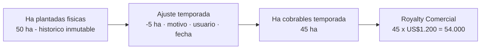

- **Ajuste Ha** por temporada: `{temporada, ha_plantadas, ajuste ±, ha_cobrables, motivo, observación, usuario, fecha, respaldo}`.
- El ajuste **NO modifica** la superficie física histórica; una temporada puede ser 45 y la siguiente volver a 50.
- **Visualización:** historial por temporada (tabla) mostrando físicas / ajuste / cobrables / motivo, más un badge cuando hay ajuste activo.

```text
┌───────── PLANTACIÓN · IQ Blue X · Campo Sta María / Bloque B3 ──────┐
│ Fecha plant.: 2026-07-10  Tipo: Comercial  Plantas: 22.000         │
├─ Historial Ha cobrables ───────────────────────────────────────────┤
│ Temporada   Ha físicas   Ajuste   Ha cobrables   Motivo            │
│ 2026/2027      10,0        0,0        10,0        —                 │
│ 2027/2028      10,0       -1,5         8,5        heladas B3        │
│ 2028/2029      10,0        0,0        10,0        —                 │
└────────────────────────────────────────────────────────────────────┘
```

---

## J. Nursery / OC Lifecycle

El proceso CURRENT (OC de vivero con despachos, fee_usd_planta, royalty_usd_planta) se **evoluciona** a un ciclo explícito con reconciliación.

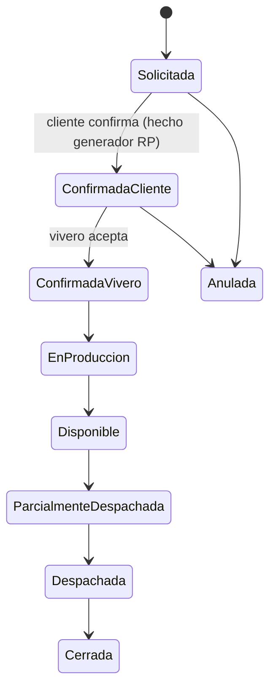

- **Hito económico clave:** *Confirmada por el cliente* → **devenga Royalty Planta** (ver K.1). El despacho/recepción son hitos operativos posteriores.
- **Reconciliación de plantas** (base del Fee Vivero y de alertas): `plantas OC cliente` vs `plantas informadas/vendidas por vivero` vs `plantas despachadas`. Diferencias → alertas.
- Una OC puede estar **parcialmente despachada**; se soporta multi-despacho (se conserva del CURRENT).

---

## K. Economic Model

Cuatro flujos de ingreso + tres estados de ciclo, todos con montos y fechas. Se **conserva** la aritmética CURRENT (congelada por tests) donde sigue siendo válida y se **añade** la capa de devengo.

### K.0 Devengo → Facturación → Cobranza (transversal a RP/RC/Fee Entrada)

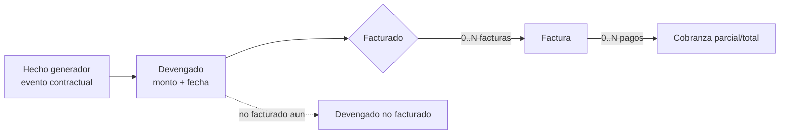

- Un **devengo** puede tener 0, 1 o N facturas. Una **factura** puede tener 0, 1 o N cobranzas (parciales). Se soporta **cobranza parcial**.
- KPIs derivados: *Devengado*, *Facturado*, *Devengado no facturado*, *Cobrado*, *Por cobrar (neto)*, *Aging*.

### K.1 Royalty Planta — hecho generador = OC confirmada

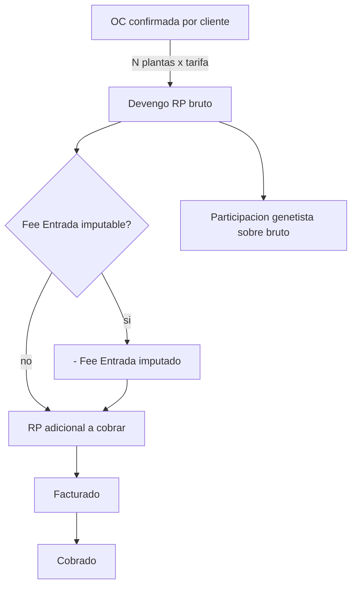

- **Cálculo:** `N° plantas confirmadas × tarifa US$/planta`. El hito es la **OC confirmada**, no el despacho/factura/pago (cambio vs CURRENT).
- Soporta: OC parcial, modificaciones, anulaciones, diferencias, **múltiples facturas y cobranzas**, trazabilidad.
- La **participación al genetista se calcula sobre el bruto** (se conserva del CURRENT), coordinada con la imputación (ver K.3 y L).

### K.2 Royalty Comercial — anual sobre ha cobrables

- **Cálculo:** `ha_cobrables(temporada) × tarifa US$/ha × factor_inflación`, cobrado una vez al año en el **mes** resuelto por jerarquía **Contrato > Cliente > Default país**.
- **Conservar** el motor CURRENT de **cohortes + inflación por temporada** (Jul–Jun); cada plantación/cohorte devenga desde su temporada de inicio; inflación desde el 2° año. Se **evoluciona** para usar **ha cobrables** (I.1) en vez de ha físicas y para exponer devengo/factura/cobranza.
- Excepciones/descuentos por temporada vía el ajuste de ha (no altera físicas).

### K.3 Fee de Entrada — único + imputable

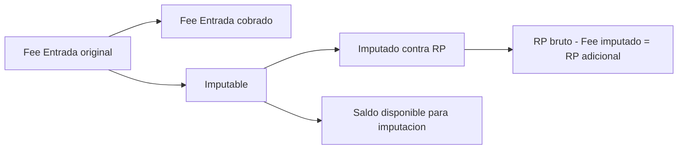

- Modelar explícito: **Fee Entrada original / cobrado / imputable / imputado / saldo disponible**.
- Al imputar: `RP bruto − Fee Entrada imputado = RP adicional a cobrar`. **No destruir historial** (se conservan todos los montos).

### K.4 Fee Vivero — circuito propio (100% Osiris)

- **El vivero paga a Osiris.** `plantas vendidas al cliente × US$/planta`. **100% Osiris, 0% genetista.**
- Relación: `Vivero → Cliente → OC → Variedad → plantas vendidas → Fee/planta → Fee generado → Factura → Cobranza`.
- Reconciliación de plantas (J) genera diferencias/alertas.

### K.5 WHT
- **WHT cliente** (`pct(pais)`: Chile 0%, Perú/México 15%) se **conserva** — reduce el neto cobrable.
- **WHT genetista** (retención sobre lo que Osiris paga al genetista) es un parámetro **por regla de participación** (ver L). Nunca confundir ambos.

---

## L. Genetista Settlement Model

Evolución de la "Reconciliación IQ" (hardcodeada) a un **Estado de Cuenta por Genetista** seleccionable para cualquier genetista.

### L.1 Participación — jerarquía de reglas (parametrizable)

Resolución en cascada (primera que matchea gana):

```
1. Condición específica de Contrato (+ variedad / tipo ingreso)
2. Variedad (+ tipo ingreso)
3. Genetista (+ tipo ingreso)
4. Default general (70/30)
```

- Cada regla: `{alcance, tipoIngreso (fee_entrada|royalty_planta|royalty_comercial), tipoCalculo (%/US$-planta/US$-ha), valor, wht, vigencia (desde/hasta o temporada), excepciones}`.
- **Default general 70/30** (70% genetista / 30% Osiris) aplica a Fee Entrada, RP y RC. **Fee Vivero excluido** (0% genetista).
- **Arreglar el match por especie** (bug CURRENT R5): matchear contra la especie del **ingreso/plantación**, no contra `ct.especie`.
- **Sin hardcode de "IQ".** IQ es un genetista más con su regla configurada.

### L.2 Anti-doble participación (regla crítica)

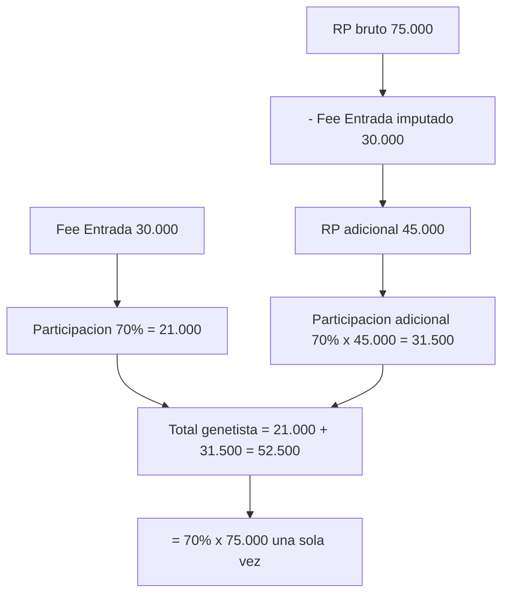

La participación se calcula sobre el **valor económico una sola vez**: cuando el Fee Entrada ya participó y luego se imputa contra RP, la participación adicional es sobre el **RP adicional**, no sobre el RP bruto completo. Requiere **trazabilidad de imputación** por contrato.

### L.3 Estado de Cuenta / Reconciliación por Genetista

```text
┌─ ESTADO DE CUENTA · Genetista: IQ · Temporada 2027/2028 ───────────┐
│ Concepto           Bruto gen.  Particip.  WHT    Neto oblig.       │
│ Fee Entrada         30.000      21.000    2.100    18.900          │
│ Royalty Planta      45.000      31.500    3.150    28.350          │
│ Royalty Comercial   54.000      37.800    3.780    34.020          │
│ ─────────────────  ─────────  ─────────  ─────   ──────────        │
│ TOTAL              129.000      90.300    9.030    81.270          │
│ Pagos realizados                                 -40.000           │
│ SALDO PENDIENTE                                   41.270           │
└────────────────────────────────────────────────────────────────────┘
```

- Estado-máquina de obligación: **devengada → parcialmente pagada → pagada** (desacoplada de la cobranza al cliente, salvo que un contrato lo condicione).
- **Comportamiento IQ CURRENT se conserva** hasta la fase técnica (los tests de Fase 0 lo congelan); el hardcode se elimina recién al implementar el TARGET.

---

## M. Visits & Reports Model

**Operación Técnica → Informes de Visitas** (conservando el desarrollo técnico existente). Fuente: `docs/osiris-fase0/visits-module-assessment.md`.

### M.1 Base común de visita + secciones por tipo
- **Tipos configurables** (no enum rígido): Técnica, Comercial, Vivero + futuros (contractual, auditoría, genetista, día de campo, recepción, prospección…).
- **Cabecera común:** fecha, tipo, responsable, participantes, contraparte, cliente/productor/vivero, ubicación, campo, bloque, especie, variedad, contrato, OC, Trial, objetivo, resumen ejecutivo, fotografías, documentos, próximos pasos, próxima visita. (No todos obligatorios.)

### M.2 Informe Técnico (CONSERVAR + EVOLUCIONAR)
- Se **conserva** la estructura agronómica de 13 secciones + workflow + PDF/HTML/email. Base común + secciones técnicas específicas. No reducirlo a un formulario genérico.
- Añade estructura de hallazgos/recomendaciones/medidas/seguimiento reutilizable.

### M.3 Informe Comercial → alimenta el pipeline
Captura: productor, oportunidad, variedades de interés, ha actuales, **ha potenciales**, Trial, nueva plantación, **fecha estimada**, **plantas estimadas**, vivero, **probabilidad**, próximos pasos, compromisos.

### M.4 Informe de Vivero → reconciliación
Relaciona: vivero, OC, cliente, variedad, plantas solicitadas/producidas/disponibles/vendidas/despachadas, fecha estimada, condición/calidad, diferencias, fotografías, riesgos, compromisos.

### M.5 Hallazgos, Recomendaciones, Compromisos (información estructurada, no solo PDF)

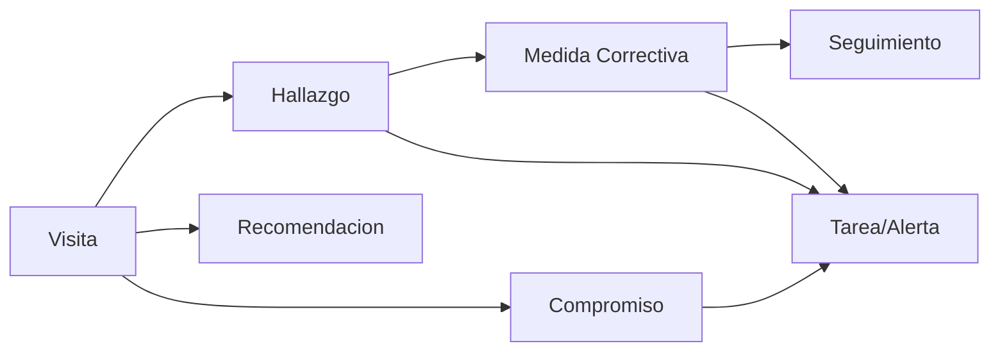

Cada uno: `{descripción, responsable, prioridad, fecha compromiso, estado, evidencia, fecha cierre}`. Alimentan **Tareas & Alertas** (O) y, en visita comercial, el **Pipeline** (Q).

### M.6 Terreno
Informes de Visitas usable desde tablet/teléfono: carga de fotos, notas, campos rápidos, guardar borrador. (Offline no se construye aún, pero la UX no debe ser exclusivamente desktop.)

```text
┌─ INFORME DE VISITA · Comercial · Agricola ABC · 2027-03-12 ────────┐
│ Tipo:[Comercial v] Resp:[N.F.] Campo:[Sta Maria] Var:[IQ Blue X]  │
│ Objetivo: evaluar ampliacion                                       │
│ -- Oportunidad --  Ha potenciales:[15]  Trial:[No]  Prob:[60%]     │
│ Fecha estim. plantacion:[2028-07]  Plantas estim.:[33.000]         │
│ Fotos(4)  Docs(1)   Hallazgos(2) · Compromisos(1) -> Tareas        │
│ Estado:[Borrador v]  Prox. visita:[2027-06]  [Guardar][PDF][Env]   │
└────────────────────────────────────────────────────────────────────┘
```

---

## N. Documents Model — Expediente Digital Osiris

Documentos **relacionados con entidades** (no una carpeta aislada). Un documento puede pertenecer a: genetista, variedad, cliente, contrato, campo, plantación, vivero, OC, visita, informe, royalty, pago.

- **Tipos:** contratos, anexos, PBR, DHE, AI, OC, facturas, comprobantes, informes, documentación técnica, declaraciones de royalties, otros.
- **Metadata:** tipo, entidad(es) asociada(s), estado, vigencia (desde/hasta), versión, confidencialidad, hash, fecha, autor.
- **Capacidades:** checklist documental por entidad, alertas por vencimiento/faltantes, versionado.
- **Evolución CURRENT:** hoy son URLs de texto; el TARGET usa upload a bucket privado + URLs firmadas (patrón Expediente Digital Nóminas ya existente en el proyecto).

---

## O. Tasks & Alerts

Capacidad **transversal**. Una tarea/alerta puede nacer desde: contrato, OC, royalty, factura, cobranza, genetista, documento, visita, hallazgo, compromiso, Trial, oportunidad.

Ejemplos: contrato pendiente de firma · contrato por vencer · Trial por evaluar · RC próximo a facturar · royalty no facturado · cobranza vencida · genetista pendiente de pago · OC incompleta · vivero atrasado · visita pendiente · compromiso vencido · documento faltante · PBR por vencer.

- **Modelo simple:** `{origen(entidad+id), tipo, prioridad (alta/media/baja), estado (abierta/en curso/cerrada/descartada), responsable, fecha límite, descripción}`. Sin sobrecomplejidad.
- Se alimentan de **eventos automáticos** (fechas, faltantes) y de **hallazgos/compromisos** de visitas.

---

## P. Trial Lifecycle

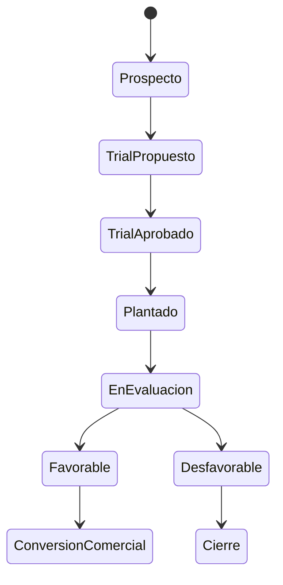

- Relaciona: productor, variedad, campo/bloque, plantas, ha, visitas, informes, resultados, oportunidad futura.
- **Conversión comercial** conecta Trial → Contrato Comercial → Plantación → Royalty (base del pipeline).
- Reemplaza el código muerto CURRENT (Test Blocks / Medidas como constantes sin uso) por una entidad real.

---

## Q. Future Royalty Pipeline

Capacidad estratégica. Tres niveles:

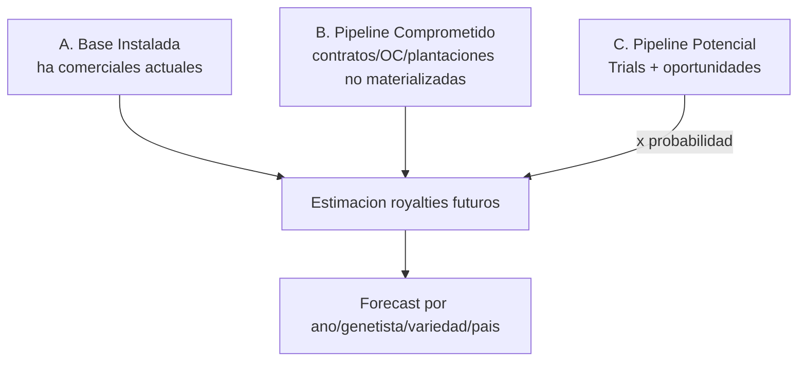

Por cada elemento estima: ha, plantas, variedad, productor, país, fecha estimada, probabilidad, tarifa estimada, **Royalty Planta futuro**, **Royalty Comercial futuro**, participación genetista, margen Osiris.

- **Datos que ya existen** (Fase 0): fechas de plantación, cohortes, Comercial/Prueba, despachos, OC.
- **Datos faltantes** (a capturar por visita comercial): ha potenciales, probabilidad, fecha estimada, plantas estimadas.
- **No se construye forecasting financiero aún**; se diseña el modelo que lo hará posible.

```text
┌─ FUTURE ROYALTY PIPELINE ─────────────────────────────────────────┐
│ Nivel            Ha      Plantas    Royalty est.   Ponderado       │
│ A Base instalada 210     640.000    US$ 312.000     312.000        │
│ B Comprometido    90     198.000    US$ 118.000     118.000        │
│ C Potencial       75     165.000    US$  96.000  x prob -> 52.000  │
│ ───────────────  ────   ────────   ───────────    ─────────        │
│ TOTAL            375   1.003.000    US$ 526.000     482.000        │
│ [Por genetista v] [Por variedad v] [Por pais v] [2028 v]          │
└────────────────────────────────────────────────────────────────────┘
```

### Q.1 Forecast & Valor del Portfolio (conceptual)
- **Forecast de royalties** 2027/2028/2029… por genetista/variedad/especie/país/cliente/productor, separando **Contracted / Committed / Pipeline** y eventualmente **Weighted Pipeline**.
- **Valor económico del portfolio:** responder "¿cuánto genera hoy y cuánto podría generar?" combinando royalties actuales, ha, crecimiento contratado, trials, oportunidades, tarifas, inflación, participación genetista y margen. **No DCF aún**, pero el modelo funcional preserva la información para construirlo.

---

## R. Executive Dashboard

Home ejecutivo (no un muro de cards). Cuatro bandas con drill-down desde cada indicador:

```text
┌─ OSIRIS · EXECUTIVE HOME ─────────────────────  [Buscar todo]  ────┐
│ PERFORMANCE (YTD)                                                  │
│  Facturado 1.24M | Cobrado 0.98M | Por cobrar 0.26M | Dev.no fact. │
│  Oblig.genetistas 0.71M | Pagado 0.55M | Saldo 0.16M | Margen 0.33M│
├────────────────────────────────────────────────────────────────────┤
│ ROYALTIES     Planta | Comercial | Fee Entrada | Fee Vivero        │
│ PORTFOLIO  Ha plant.|Ha cobr.|Ha com.|Ha Trial|Plantas|Clientes|.. │
│ FUTURE VALUE  Ha comprom.|Ha Trial|Ha potenc.|Pipeline $|Forecast  │
├────────────────────────────────────────────────────────────────────┤
│ ATTENTION  3 contratos por vencer · 5 royalty por facturar ·       │
│  2 cobranzas vencidas · 1 genetista pendiente · 4 OC incompletas · │
│  6 visitas pendientes · 3 docs faltantes · 2 compromisos vencidos  │
└────────────────────────────────────────────────────────────────────┘
```

- **PERFORMANCE:** Facturación/Cobranza YTD, Cuentas por cobrar, Devengado no facturado, Obligaciones/Pagos/Saldo genetistas, **Margen Osiris**.
- **ROYALTIES:** Planta · Comercial · Fee Entrada · Fee Vivero.
- **PORTFOLIO:** Ha plantadas/cobrables/comerciales/Trial, plantas licenciadas, clientes activos, variedades activas, países.
- **FUTURE VALUE:** Ha contratadas pendientes, Ha Trial, Ha potenciales, nuevas OC, Pipeline, forecast.
- **ATTENTION:** lista accionable (cada ítem → filtro/ficha).
- Comparativos (cuando exista presupuesto/forecast): Real vs Ppto vs Año Anterior vs Forecast.

---

## S. Reporting & Analytics

Tres niveles, sin crear 30 reportes sin propósito. Reutiliza el export PDF/Excel CURRENT.

| Nivel | Audiencia | Reportes clave |
|---|---|---|
| **Operacional** | equipo | OC y estados, despachos y diferencias, visitas/informes, tareas abiertas, documentos faltantes. |
| **Management** | gerencia | Ingresos por concepto/temporada, cobranza y aging, ha/plantas por variedad/especie/país, contratos vigentes, ranking de variedades/clientes, estado de genetistas. |
| **Executive / CFO** | dirección | Performance (facturado/cobrado/por cobrar), margen Osiris, obligaciones y saldo genetistas, **Future Royalty Pipeline**, forecast, concentración (por cliente/variedad/país), valor del portfolio. |

### S.1 Presupuesto / Forecast (preparación)
Preparar Osiris para comparar **Real vs Presupuesto vs Año Anterior vs Forecast** en: ingresos, ha, plantas, royalties, margen, nuevas plantaciones. **No se implementa presupuesto aún** (no hay capacidad CURRENT que conservar); el modelo funcional preserva las dimensiones (temporada, concepto, genetista, variedad, país) necesarias para construirlo.

---

## T. Roles & Permissions (conceptual, sin RLS aún)

| Rol | Ve | Crea/Modifica | Aprueba | Económico sensible |
|---|---|---|---|---|
| **Administrador** | todo | todo | todo | sí |
| **Gerencia/CFO** | todo | condiciones económicas, participación | contratos, pagos genetista | **sí** (cambia participación, ha cobrables, registra pagos) |
| **Finanzas** | económico + operativo | facturas, cobranzas, pagos | cobranza | registra pagos; **no** cambia participación |
| **Comercial** | clientes/contratos/visitas/pipeline | contratos (borrador), visitas comerciales, oportunidades | — | no |
| **Técnico** (ej. gerente técnico) | operación técnica, variedades, trials | visitas/informes técnicos, trials | aprueba informes técnicos | no |
| **Consulta** | lectura + export | — | — | no |

Decisiones a nivel de acción sensible: **quién puede cambiar condiciones económicas, ha cobrables, imputar Fee Entrada, registrar pagos, anular OC, eliminar/anular** → tabla de permisos por acción (no solo por módulo). RLS se implementa en la fase de seguridad.

---

## U. Audit & Traceability + Soft Delete

### U.1 Auditoría de eventos críticos
Registrar `{usuario, fecha/hora, entidad, valor anterior, valor nuevo, motivo}` para: cambio de ha cobrables, cambio de tarifa, modificación de contrato, cambio de participación genetista, imputación Fee Entrada, anulación de OC, modificación de plantas, override, cambio de estado, eliminación lógica. (Evoluciona el `window.auditLog` parcial CURRENT.)

### U.2 Soft delete
Registros económicos, contractuales y de plantaciones **no desaparecen físicamente** por acción normal. Estados: **activo / inactivo / anulado / archivado**. Se preserva trazabilidad e histórico (coherente con el patrón de soft-delete ya usado en Nóminas). Borrado físico solo por proceso administrativo controlado.

---

## V. Extensibility Principles

**Configuración sobre hardcode** cuando exista probabilidad razonable de variación, **sin sobreingeniería** (extensible, no abstracto-incomprensible). Deben poder agregarse sin reconstruir: genetistas, especies, variedades, países, viveros, tipos de contrato, tipos de royalty, fees, reglas económicas, tipos de visita, documentos, estados, alertas, KPIs.

Como catálogos configurables: tipos de visita, tipos de contrato, tipos de documento, reglas de participación, mes de cobro RC, estados de OC/contrato. Como código (poco variable): la aritmética base de RP/RC/Fee.

---

## W. Future Mediterra One Boundary (fuera de alcance)

Mediterra One **no** se integra ahora. Entidades/eventos que eventualmente cruzarían el límite de integración (solo como *boundary*, sin diseñar APIs):

| Osiris | Mediterra One |
|---|---|
| Clientes/Productores, Viveros | Clientes / Proveedores |
| Facturas (RP/RC/Fee/Fee Vivero) | Facturación / CxC |
| Cobranzas | Tesorería / CxC |
| Obligaciones y pagos a genetistas | CxP / Pagos |
| Devengos | Contabilidad (asientos) |
| Forecast/Pipeline royalties | Presupuesto / Management Reporting |

---

## X. Open Decisions (requieren aprobación de negocio)

| # | Pregunta | Contexto | Alternativas | Recomendación | Impacto |
|---|---|---|---|---|---|
| 1 | ¿El pago al genetista depende de haber cobrado al cliente? | §20 dice desacoplado salvo contrato | (a) siempre desacoplado (b) condicionable por contrato | **(b)** default desacoplado, flag por contrato | **BLOCKER** para el estado de cuenta |
| 2 | ¿La imputación Fee Entrada→RP es por contrato, y total o parcial? | §15-16 | (a) total una vez (b) parcial con saldo | **(b)** saldo imputable, permite parciales | **BLOCKER** para RP |
| 3 | ¿Campos/Bloques son entidades obligatorias o el bloque es opcional? | §11 | (a) Campo→Bloque→Plantación siempre (b) Bloque opcional | **(b)** bloque opcional (algunos predios no lo usan) | IMPORTANTE |
| 4 | ¿Mes de cobro RC: jerarquía Contrato>Cliente>País confirmada? | §14 | como escrito / agregar variedad | **Contrato>Cliente>País** | IMPORTANTE |
| 5 | ¿WHT genetista es por regla, por país del genetista, o ambos? | §L | (a) por regla (b) por país | **(a) por regla** (más flexible) | IMPORTANTE |
| 6 | ¿Probabilidad del pipeline es manual o por etapa (mapa etapa→%)? | §32 | (a) manual (b) por etapa (c) ambos | **(c)** default por etapa, override manual | PUEDE DEFINIRSE DESPUÉS |
| 7 | ¿Participación admite US$/planta y US$/ha además de %? | §18 | solo % / % + montos | **% + montos** (compatibilidad futura) | PUEDE DEFINIRSE DESPUÉS |
| 8 | ¿Multi-moneda (algún genetista/contrato en EUR/otra)? | CURRENT usa USD | USD / multi-moneda | confirmar con Angelo | IMPORTANTE |
| 9 | ¿Fee Vivero puede tener excepción con participación de genetista? | §17 dice 0% | 0% fijo / configurable | **0% fijo** salvo decisión explícita | PUEDE DEFINIRSE DESPUÉS |
| 10 | ¿Qué define "cliente activo" / "variedad activa" para KPIs? | §R | reglas de negocio | definir umbral (contrato vigente / plantación con royalty) | PUEDE DEFINIRSE DESPUÉS |

---

## Y. Recommended Technical Phases (propuesta, NO ejecutar)

Orden por **dependencias reales** (ajustado sobre la lista de referencia). No implementar hasta aprobar este documento.

| Fase | Foco | Depende de |
|---|---|---|
| **T0 — Preparación / Aislamiento** | Rama + **git worktree exclusivo Osiris** (ver regla de aislamiento) | aprobación de este doc |
| **T1 — Modelo relacional + migración espejo** | Esquema (FK), migrador dry-run de strings→FK, migración validada contra Data Integrity Manifest; blob como respaldo | T0 |
| **T2 — Fichas 360° + Campos/Bloques/Plantaciones** | Cliente/Variedad/Genetista/Vivero 360; entidad Campo→Bloque; ha físicas/cobrables | T1 |
| **T3 — Motor Económico v2** | Extraer `economic-engine/` (con los 32 tests de Fase 0 como red), devengo/factura/cobranza, RP por OC confirmada, Fee Entrada imputable, 70/30 parametrizable, Estado de Cuenta genetista, Fee Vivero | T1, T2 |
| **T4 — Contratos / OC / Viveros** | Ciclos de contrato y OC; reconciliación de plantas | T2, T3 |
| **T5 — Informes de Visitas** | Base común + secciones por tipo; hallazgos/compromisos → tareas; terreno | T2 |
| **T6 — Documentos (Expediente Digital)** | Bucket privado + URLs firmadas; checklist/alertas | T2 |
| **T7 — Tareas & Alertas** | Motor transversal (eventos + hallazgos) | T3–T6 |
| **T8 — Dashboard & Future Royalty Pipeline** | Executive Home, pipeline 3 niveles, forecast conceptual, reporting | T3, T4, T5 |
| **T9 — Seguridad / RLS** | Auth relacional (scaffold `REACT_APP_AUTH_DUAL`), RLS, roles/permisos | T1 (plan 2 fases por lockout previo) |
| **T10 — QA + Cutover desde blob** | Validación integral, deprecación del blob, tag de release | todas |
| **T11 — Integración Mediterra One** (futuro) | Solo cuando Osiris esté sólido | T10 |

### Regla de aislamiento para implementación (por el incidente de Fase 0)
**Ninguna fase futura de implementación Osiris debe trabajarse en el mismo working tree que otras sesiones.** Al implementar: rama exclusiva + **git worktree exclusivo** (ej. `osiris-fase1` en un working directory separado). No se ejecuta todavía (esta etapa es solo diseño); queda establecido como requisito de T0.

---

## Cierre

Este documento es el **Modelo Funcional Objetivo Osiris v1.0**. Resume: (1) qué CONSERVAR (contrato como fuente de verdad, motor RC de cohortes+inflación, informe técnico, exports), (2) qué EVOLUCIONAR (participación, RP, viveros, predios→campos/bloques, Operación Técnica→Informes de Visitas), (3) qué REEMPLAZAR (estados por devengo, IQ hardcode, match por especie, blob→relacional), y (4) qué es NUEVO (ha cobrables, imputación Fee→RP, obligación devengada, pipeline, expediente, tareas/alertas, executive home).

**No implementar. No modificar código/data/schema/Supabase/RLS/UI. No avanzar a la fase técnica.** Esperar aprobación del Modelo Funcional Objetivo Osiris v1.0.
