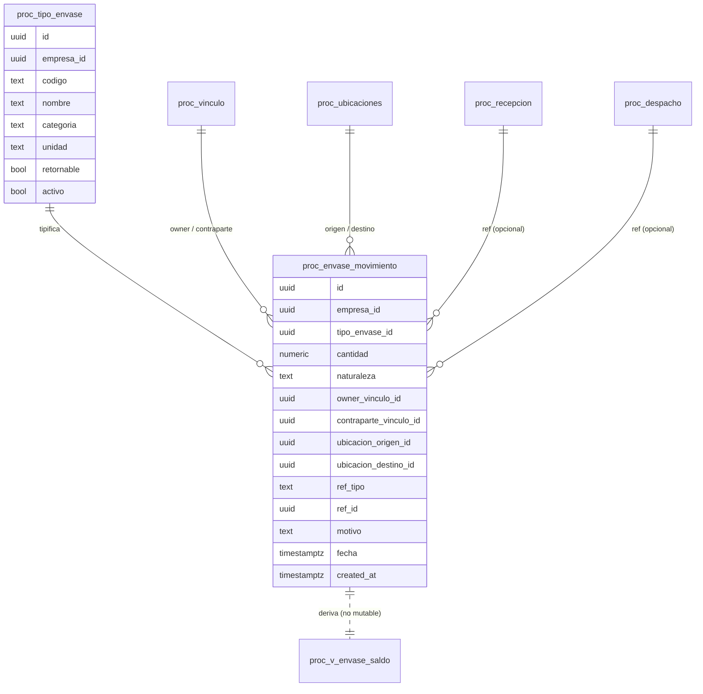

# PROC-ENVASES-001 · Modelo TARGET — Control de envases retornables

Estado: **DISEÑO / DISCOVERY. NO materializado.** Solo documentación. Sin SQL, sin frontend, sin migraciones.
Alcance: Allegria Service / `proc_*`. No toca Frisku/`frisku_*`/`friskuBI`, Allegria Foods/`exp_*`, Osiris, main.

## 1. Principio (B1, B18)

Un **envase retornable** (bin, tote, rejilla, caja/pallet retornable, u otro configurable) es un **activo/unidad logística retornable**, NO fruta, NO producto terminado, NO material consumible. Su cantidad debe controlarse con un ledger propio y **no se mezcla con `proc_movimiento`** (kg de fruta): mezclar cambiaría la semántica física del ledger de fruta y contaminaría conciliación de masa, saldos de lote y Reporting Daily. Se distingue explícitamente del **material de embalaje consumible** (bolsa, etiqueta, caja desechable), que pertenece a otro control de costo y queda fuera de este alcance.

## 2. Preguntas de negocio que el modelo debe responder (B2, B16)

De quién son los envases · quién los tiene ahora · dónde están · cuántos entraron/salieron/devolvieron · cuántos pendientes de devolución · cuántos dañados/perdidos · qué contraparte mantiene saldo. Y en las **dos direcciones** (no simétricas): "¿cuántos bins nos debe devolver el Productor X?" y "¿cuántos bins del Cliente Y tenemos nosotros?".

## 3. Propietario vs Tenedor/Custodio (B3, B13, B14, B15)

Propiedad y tenencia son dimensiones **separadas**; nunca la misma columna.

- **Propietario (owner)**: Cliente, Productor, Exportadora, **Allegria Service** o tercero — vía identidad Core (`proc_vinculo`). No se crea padrón paralelo; no se usan maestros Frisku ni `exp_*`. Service como owner se representa con un vínculo propio de rol `servicio`/`interno` (o convención `owner IS NULL ⇒ Service`; ver ENV-D3).
- **Tenedor/custodio actual**: quién tiene físicamente los envases en un momento (Service en planta, o la contraparte tras devolución). Se deriva del ledger + ubicación, no se guarda como verdad mutable.

El propietario NO es necesariamente el Cliente que contrata: `Cliente Service = Exportadora X`, fruta de `Productor Y`, bins propiedad de `Productor Y` — debe ser representable (B14). También Service-owned entregados a la contraparte, con saldo por devolver a Service (B15).

## 4. Catálogo de tipos de envase (B4)

`proc_tipo_envase` (naming a confirmar), tenant-scoped y auditado: `empresa_id, codigo, nombre, categoria, unidad, retornable (bool), capacidad_referencial (opcional), activo, created_at/by, updated_at/by, deleted_at`. Ejemplos configurables: BIN, TOTE, REJILLA — **no hardcodear** la lista (mismo patrón que el maestro de Tipos de Documento Contractual recién entregado).

## 5. Unidad de control: cantidad, no serial (B5, ENV-D1)

Discovery: **cero columnas serial/barcode/sscc en todo `proc_*`** → CURRENT no serializa nada. Primera versión: **control por cantidad de unidades** (50 bins, 120 totes, 400 rejillas). NO individualizar cada envase con UUID físico. Si la planta usa envases serializados (barcode/RFID por unidad), es una decisión estructural que se eleva **antes** de diseñar serialización (ENV-D1), no se asume.

## 6. Ledger propio append-only (B6, B26, ENV-D2)

`proc_envase_movimiento` como **única fuente de verdad**, espejando el patrón del ledger de fruta (`proc_movimiento` tiene `trg_block_*` que bloquea UPDATE/DELETE + `trg_audit_*`). El saldo se **deriva** del ledger; NO existe tabla mutable de saldo como autoridad (B10).

Naturaleza/tipo de movimiento (conceptuales; nombres finales contra CURRENT):
`ingreso` (entra a custodia Service) · `salida`/`entrega` (sale de Service) · `devolucion` (Service devuelve al owner) · `recepcion_devolucion` (owner devuelve a Service) · `transferencia_interna` (entre ubicaciones, stock total no cambia) · `ajuste_pos`/`ajuste_neg` · `dano` · `perdida` · `baja`.

Dimensiones por movimiento: `empresa_id, tipo_envase_id, cantidad, naturaleza, owner_vinculo_id, contraparte_vinculo_id (holder de/hacia), ubicacion_origen_id, ubicacion_destino_id, ref_tipo (recepcion|despacho|manual|conciliacion), ref_id, motivo, fecha_operacional, transaccion_id, created_by, created_at`. Reusa la fecha operacional canónica (America/Santiago) ya resuelta en T10C.

**Concurrencia (B26)**: si una salida exige saldo disponible, el backend lockea/valida (advisory lock o `SELECT … FOR UPDATE` sobre el agregado) → dos movimientos simultáneos no producen saldo negativo imposible; uno tiene éxito, el otro se rechaza. Nunca confiar en React.

## 7. Saldos derivados (B10, B16)

Vistas de saldo (read-model) derivadas del ledger, agrupables por: tipo de envase · propietario · tenedor/custodio · cliente · productor · ubicación · planta. La posición se calcula por contraparte y dirección:
- **"Nos deben devolver"**: envases owner=contraparte, en custodia Service (holder=Service) → saldo positivo a favor nuestro por cobrar/recibir devolución… no; a la inversa. Ver B16: son dos posiciones distintas, cada una es Σ(entradas)−Σ(salidas) filtrada por owner y dirección.
- **"Les debemos devolver"**: envases owner=Service entregados a la contraparte.

## 8. Ubicación (B11, ENV-D4)

Reutilizar `proc_ubicaciones` (hoy tipos camara/patio/zona). Se añade, vía maestro existente, ubicaciones relevantes a envases (ej. "Bodega de envases", "Zona lavado") como nuevos `tipo`/registros — **sin duplicar** el maestro de ubicación. Recomendación: reutilizar (ENV-D4).

## 9. Estado/condición (B12, ENV-D5)

Mínimo imprescindible para no falsear una devolución: registrar **DAÑO, PÉRDIDA, BAJA** como naturalezas del ledger (no como "devolución"). Estados extendidos (disponible/en uso/sucio/lavado) se evalúan pero **no se sobre-diseñan** si la operación no los necesita (ENV-D5).

## 10. Relación con Recepción (B7, B21)

Una recepción puede traer envases (100 bins Cliente A + 40 totes Productor B). Se registran **envases recibidos asociados a la recepción** → generan movimientos de envase con `ref_tipo=recepcion, ref_id=REC`. **NO se suman como kg de fruta** ni tocan `proc_movimiento`. Sección opcional en Nueva Recepción (B21); si no hay envases retornables, no aparece/no obliga.

## 11. Relación con Despacho + devolución independiente (B8, B9, B22)

Al despachar/devolver, un despacho puede incluir envases (60 bins, 20 totes) → movimientos con `ref_tipo=despacho`. Pero **no se exige** que el despacho de envases coincida con un despacho de PT. Caso obligatorio (B9): el cliente viene solo a retirar bins vacíos — sin fruta, sin pallet, sin PT — el sistema registra salida/devolución de envases **sin inventar un despacho de fruta** (`ref_tipo=manual`).

## 12. Tenancy / RLS / auditoría (B25)

Todo `proc_envase_*` nace tenant-scoped (`empresa_id`), **RLS strict** (`empresa_id = proc_current_empresa()` como el resto de `proc_*`), auditado (created/updated/by + ledger append-only), **anon DENY**. El DEV bridge es solo para pruebas visuales, nunca arquitectura productiva.

## 13. ERD textual (conceptual)

## 14. Lo que este modelo NO hace (fronteras)

No serializa por unidad (salvo ENV-D1 aprobado) · no mezcla con `proc_movimiento` de fruta · no factura envases por defecto (B28: no asumir facturables) · no gestiona consumibles · no implementa conciliación física en v1 (solo deja el modelo listo, B17/ENV-D8) · no toca Reporting Daily en el mismo bloque (B24) · no crea padrón de empresas paralelo.
