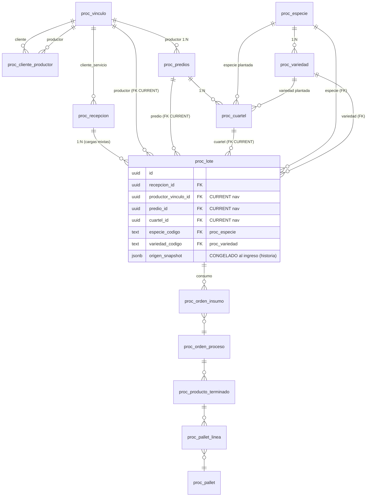

# PROC-MAESTROS-TRAZABILIDAD-001 — Modelo TARGET (diseño, NO materializado)

**Fecha:** 2026-08-14 · **Estado:** DISEÑO para aprobación del CFO. **No se escribió SQL, schema, frontend, tests productivos ni migración.** Bounded context `proc_*` (Allegria Service). Base: discovery `docs/proceso-f7-8-2-trazabilidad-agricola-gate.md`.

## 1. Principio: dos dimensiones ortogonales
El origen agrícola y la relación comercial son **dimensiones distintas** que convergen en el Lote:

- **Comercial:** `Cliente del servicio` (quien contrata/paga la maquila). Vive en `proc_recepcion` (evento físico/logístico).
- **Origen agrícola:** `Productor → Predio → Cuartel → (Especie → Variedad)`. **Autoridad = el Lote** (unidad de identidad/trazabilidad), no la cabecera de recepción.

Reglas que el modelo debe garantizar: Cliente ≠ Productor; Productor N:M Cliente (reutilizable); Predio pertenece a Productor; Cuartel pertenece a Predio; Variedad pertenece a Especie (integridad en backend); un Lote tiene origen inequívoco; una Recepción puede generar Lotes de distinto origen (cargas mixtas).

## 2. ERD TARGET



Leyenda: los FK en el Lote sirven la **navegación CURRENT** (filtros, drill); `origen_snapshot` sirve la **historia inmutable** (§5).

## 3. Entidades nuevas y extendidas

### 3.1 `proc_especie` (NUEVO catálogo, tenant-scoped)
`id, empresa_id, codigo, nombre, nombre_en?, icono?, activo, + auditoría/soft-delete`. `UNIQUE(empresa_id, codigo)`. Neutral del bounded context (no Frisku, no `exp_*`). Reemplaza el `especie_codigo` texto libre como **FK target** de: `proc_lote`, `proc_recepcion`, `proc_orden_proceso`, `proc_producto_terminado`, `proc_programa_proceso`, `proc_calibre`, `proc_color`, `proc_qc_parametro`, `proc_cuartel`.

### 3.2 `proc_variedad` (NUEVO catálogo, tenant-scoped)
`id, empresa_id, especie_codigo FK→proc_especie, codigo, nombre, activo, + auditoría`. `UNIQUE(empresa_id, especie_codigo, codigo)`. **Integridad en backend**: la FK a especie hace imposible guardar `Santina/Arándano` si Santina es de Cereza. La UI filtra variedades por especie (consecuencia, no autoridad).

### 3.3 Productor — extensión de identidad
**Recomendación:** el Productor SIGUE siendo `proc_vinculo` (rol `productor`) — no duplicar identidad. Agregar atributos de identidad **opcionales** a `proc_vinculo`: `rut`, `csg_sag`. Son atributos de identidad (aplican a productor y potencialmente a exportadora), no ownership. *Alternativa evaluada:* tabla 1:1 `proc_productor(vinculo_id PK, rut, csg_sag)` — más limpia si se quiere aislar lo agronómico; cuesta un JOIN extra. Decisión al CFO (§decisiones).

### 3.4 `proc_cliente_productor` (NUEVO, relación N:M)
`id, empresa_id, cliente_vinculo_id FK, productor_vinculo_id FK, vigencia_desde?, vigencia_hasta?, activo, + auditoría`. `UNIQUE(empresa_id, cliente_vinculo_id, productor_vinculo_id)`. Modela "qué productores procesa cada cliente" **sin ownership**: el Productor 2 es UNA entidad referenciada por Cliente A y Cliente B. Vigencia opcional por si la relación es estacional.

### 3.5 `proc_predios` — EXTENDER (ya existe)
Hoy: `productor_vinculo_id, codigo, nombre, pais_codigo, region`. Agregar: `csg_sag`, `comuna`, `superficie_ha`, `activo`. Exponer en la UI de Configuración (hoy no está). Obligatorios: productor, codigo, nombre. Opcionales: csg_sag, comuna, superficie.

### 3.6 `proc_cuartel` (NUEVO)
`id, empresa_id, predio_id FK→proc_predios, codigo, nombre, superficie_ha?, especie_codigo FK→proc_especie, variedad_codigo FK→proc_variedad, activo, + auditoría`. `UNIQUE(empresa_id, predio_id, codigo)`. Un cuartel pertenece a un predio y (típicamente) tiene una especie/variedad plantada. **Nota:** la especie/variedad del cuartel es un *default*; la autoridad de lo procesado es el `origen_snapshot` del Lote (un cuartel puede replantarse entre temporadas — §decisión CFO).

### 3.7 `proc_lote` — EXTENDER (cambio central)
Agregar FKs de origen (nullable, para compat): `productor_vinculo_id`, `predio_id`, `cuartel_id`; convertir `especie_codigo`/`variedad_codigo` en FK a los catálogos. Agregar `origen_snapshot jsonb` (§5). **El Lote pasa a ser la autoridad del origen agrícola.**

### 3.8 `proc_recepcion` — sin ruptura
`cliente_servicio_vinculo_id` permanece (dimensión comercial). Los campos de origen de la cabecera (`productor_vinculo_id`, `predio_id`, `variedad_codigo`, `especie_codigo`) quedan como **default/prefill** para el caso single-origin, **no como autoridad**. Se documentan como "conveniencia"; la trazabilidad se lee del Lote. Aditivo, sin borrar columnas (§migración).

## 4. Recepción vs Lote (autoridad del origen)
- **Recepción** = evento físico/logístico de llegada: cliente del servicio, planta, guía de despacho, transportista, fecha, patente. Puede tener un origen "por defecto" para agilizar el caso simple.
- **Lote** = unidad de identidad/trazabilidad agrícola: productor, predio, cuartel, especie, variedad + `origen_snapshot`. Una recepción física genera 1..N lotes, cada uno con su propio origen (cargas mixtas resueltas naturalmente).

Esto encaja con la columna vertebral de genealogía CURRENT: `pallet → pallet_linea → PT → orden → proc_orden_insumo(lote_id) → proc_lote`. Al vivir el origen en el Lote, la genealogía lo recoge sin tocar el ledger (`proc_movimiento` no cambia).

## 5. Snapshot histórico (obligatorio)
Cada Lote congela, **al ingreso** (`proc_fn_ingresar_lote_ubicado` extendido), un `origen_snapshot jsonb` mínimo suficiente para auditoría/exportación:

```json
{
  "productor": { "nombre": "Agrícola Las Nieves SpA", "csg_sag": "12345", "rut": "76.xxx.xxx-x" },
  "predio":    { "nombre": "Fundo Santa Elena", "csg_sag": "P-987", "comuna": "Rengo", "region": "O'Higgins" },
  "cuartel":   { "codigo": "C-01", "nombre": "Cuartel 1" },
  "especie":   { "codigo": "CHE", "nombre": "Cereza" },
  "variedad":  { "codigo": "SANTINA", "nombre": "Santina" },
  "congelado_at": "2025-12-10T..."
}
```

**Por qué estos campos:** son los que exige la trazabilidad SAG/exportación y los que cambian en el maestro con el tiempo (nombre, CSG, comuna). **FK vs snapshot:** las FKs dan navegación/filtrado CURRENT; el snapshot da la verdad histórica. Si mañana cambian el nombre/CSG del productor, la FK muestra el valor nuevo y el snapshot demuestra qué había al ingreso. **No** se duplican todas las columnas: solo el mínimo de identidad+ubicación+especie/variedad. Patrón idéntico al snapshot de destinatarios de F5/F7.6.

## 6. Genealogía end-to-end (E)
`proc_fn_pallet_genealogia` se extiende para, por cada lote origen, devolver `productor/predio/cuartel/especie/variedad` desde el **`origen_snapshot` del Lote** (inmutable) + etiquetas CURRENT para navegar. El Cliente del servicio se devuelve como **dimensión paralela** (de la recepción del lote), no como padre del origen.

- **Hacia atrás:** despacho → pallet → PT → orden → lote → `origen_snapshot` (productor/predio/cuartel/especie/variedad). Pallet mixto → múltiples orígenes (uno por lote componente). Repaletizaje N:M conserva la genealogía porque `pallet_linea.pt_id` mantiene la cadena.
- **Hacia adelante:** "¿qué pasó con la fruta del Cuartel C-01?" → lotes con `cuartel_id=X` → órdenes/PT/pallets/despachos.

## 7. Tenancy / RLS (M)
Todos los catálogos y entidades nuevas son **tenant-scoped** (`empresa_id`) con el patrón RLS estricto CURRENT de `proc_*` (`FORCE` + policy `empresa_id=proc_current_empresa()` + `REVOKE anon` + `GRANT authenticated`). **Recomendación:** especie/variedad **por empresa** (no globales) — consistente con `proc_calibre`/`proc_color` que ya son tenant-scoped, y cada procesador puede tener su propio universo varietal. *Alternativa:* datos de referencia globales (una tabla `ref_especie`), más DRY pero rompe el aislamiento y el patrón CURRENT — **no recomendada**. No se toca el modelo de autenticación (gap transversal `CORE-IDENTITY-TENANCY-001` aparte).

## 8. Normalización / duplicados (H)
Todos los maestros nuevos usan el mecanismo canónico F7.6.1 (`normalizarNombre`, `claveNormalizada`, dedup, sugerencia no destructiva) en los campos de **nombre/display**. Distinto para **identificadores oficiales** (`rut`, `csg_sag`, `codigo` de especie/variedad/cuartel): normalización **determinística propia** (trim, mayúsculas, formato RUT con guión/DV, sin "Title Case") y NUNCA alteración semántica. Dedup por `claveNormalizada` del nombre + por `codigo`/`csg` exacto. El `origen_snapshot` histórico **no** se retro-normaliza.

## 9. Frisku / Foods isolation (L)
0 FK/dependencia funcional a `frisku_*`/`friskuBI`/`exp_*`. Especie/variedad son catálogos **propios** de `proc_*`. Cliente/productor/predio/cuartel salen de `proc_*`. Allegria Foods como cliente = `proc_vinculo` intercompany (sin `exp_*`). Infra Supabase compartida (neutral) declarada, no es dependencia de negocio.

## 10. Resumen de objetos
| Objeto | Acción | Tipo |
|---|---|---|
| `proc_especie` | crear | catálogo tenant |
| `proc_variedad` | crear (FK→especie) | catálogo tenant |
| `proc_cuartel` | crear (FK→predio, especie, variedad) | entidad tenant |
| `proc_cliente_productor` | crear (N:M) | relación tenant |
| `proc_predios` | extender (csg, comuna, superficie, activo) + UI | entidad tenant |
| `proc_vinculo` | extender (rut, csg_sag opcionales) | identidad |
| `proc_lote` | extender (FKs origen + `origen_snapshot`) | **cambio central** |
| `proc_recepcion` | origen de cabecera pasa a default (no autoridad) | sin ruptura |
| `proc_fn_ingresar_lote_ubicado` | extender (params origen + build snapshot) | RPC |
| `proc_fn_pallet_genealogia` | extender (origen desde snapshot del lote) | RPC lectura |
| read-models `proc_v_*_listado` | agregar columnas origen | aditivo |
| `proc_calibre/color/qc_parametro/PT/orden/programa` | `especie_codigo`→FK | integridad |

Ver impacto detallado en `proceso-maestros-trazabilidad-impact-assessment.md`, migración en `-migration-plan.md`, UX en `-ui-ux.md`, tests en `-test-plan.md`.
